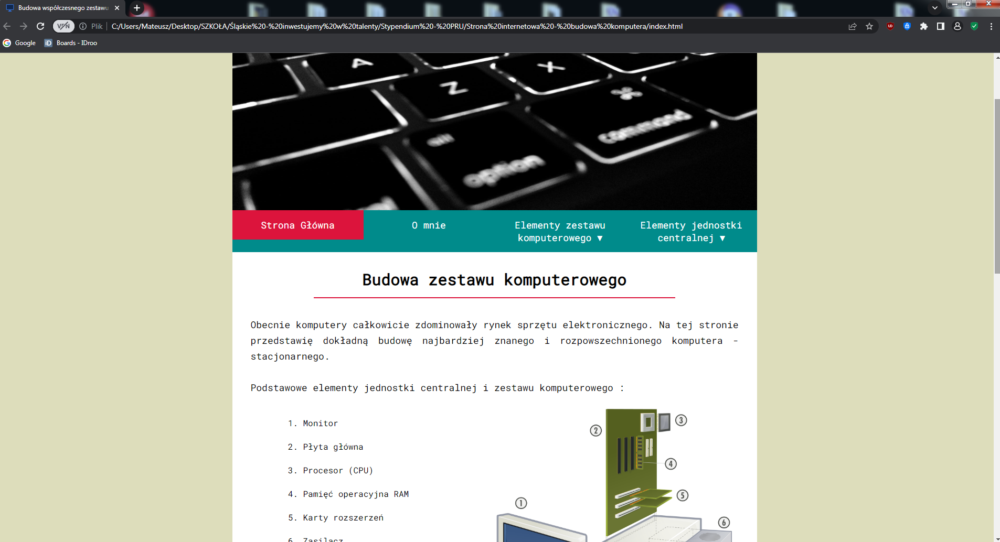

# Website about a computer construction 
This is a simple website presenting and describing the construction of a computer kit and each of its parts separately. Open, read and learn how a computer is built.

## Install and open
Clone the repository and open the "index.html" file to open the website.

## Stack
HTML, CSS

## Preview screenshot

